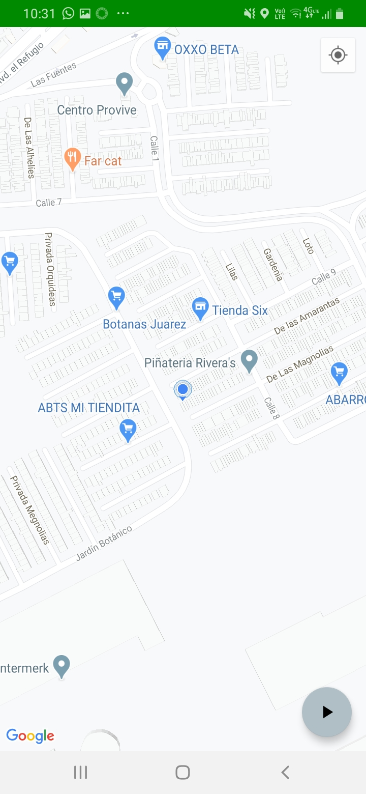
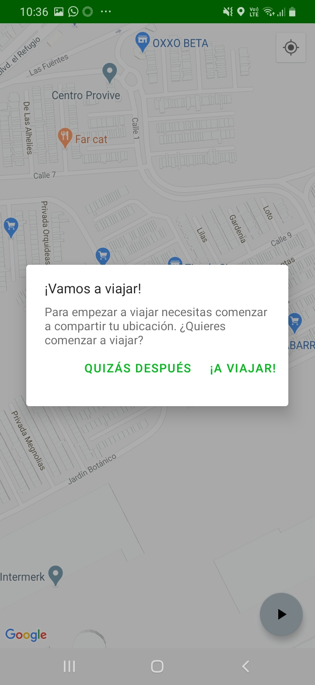
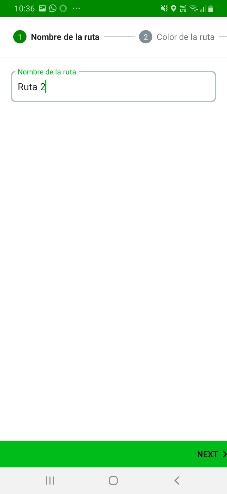
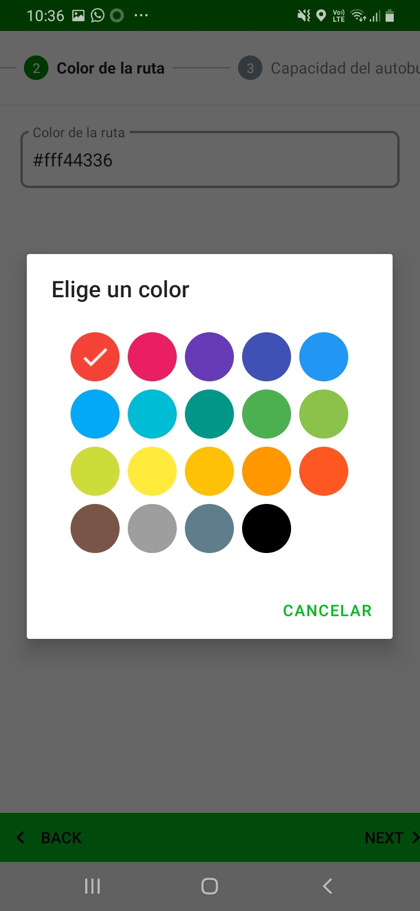
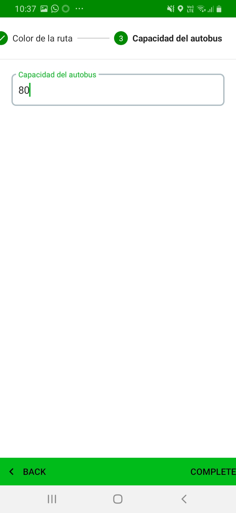
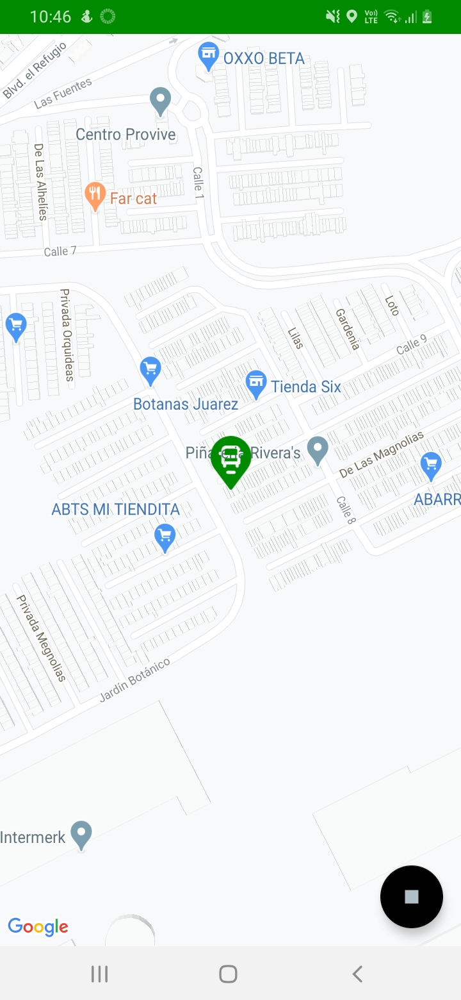
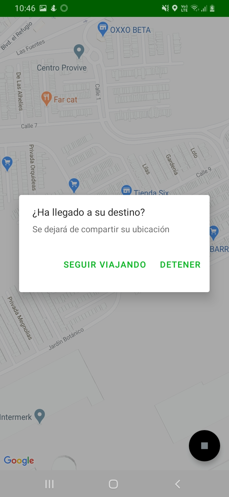

# Gobus app MVP

This is a project for the Architect Coders' certification. This app is an MVP (Minimum Viable Product).
With it we intended to show the user current location in the map. The user can also start sharing it
location by saving it in a Firestore database (A firebase database).

## Screenshots

## Features

For this very first version app we build a demo app with the next features:

- Show current user position.
- Create a new bus a save it in firestore.
- Start new travel by sharing the current user location.
- Stop travel.

## Implementation Guidance

### Android Jetpack Components

This project implement the next Android Jetpack Components:

#### Architecture Components

- Data binding
- Lifecucles
- LiveData
- Navigation
- Room
- ViewModel

#### Foundation Components

- AppCompat
- Android KTX
- Test

#### UI Components

- Animation &
- Fragment
- Layout

#### Behavior

- Permissions

### Layers

This project follows a Clean Architecture, so that, we divided the app on different individual modules: presentaiton, use cases, data, domain.

- Presentation: UI & View Models.
- Use Cases: AddNewBusWithTravelers, GetActualBusWithTravelers, GetActualTraveler, ShareActualLocation.
- Domain: Bus, BusWithTravelers, BusIcon, Traveler, LatLng.
- Data: BusRepository, TravelerRepository, BusLocalDataSource, TravelerLocalDataSource, LocationDataSource, BusRemoteDataSource, TravelerRemoteDataSource, MapMarkerDataSurce, MapResourcesDataSource, TravelControlDataSource.
- Framework: Room, Firebase, Android Jetpack.

### Data persistence - Room

This project uses Room for saving user's travel data.

### Remote data persistence - Firebase Firestore

In order to persists the data remotly, we implement a firestore database in a Firebase project.

### Permission Manager - Dexter

To manage the app permissions at runtime we use Dexter library.

### Service locator - Koin

To provide all dependencies we use Koin. It inject the dependencies as a service locator in runtime.

### Unit and Integration Tests - JUnit, Mockito, Mockk

The tests libraries used on this project are JUnit to JVM tests, Mockito and MockK to creating mock datas. 

### UI Tests - JUnit, Mockito, MockK, KoinTest, Robolectric

Robolectric is used to run UI tests in JVM environment.

### CI - Github Actions

You can read the Github workflow file to know the current CI implementation.

### Code coverage - JaCoCo / Codecov

This project implements JaCoCo in order to generate code coverage reports. We use Codecov service to generate graphic, interactive and easy diplays code coverage reports.